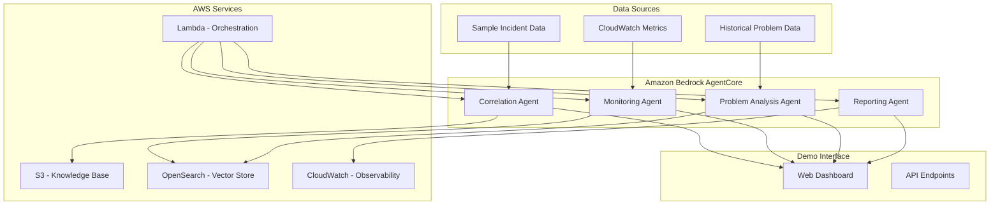

# Design Document

## Overview

This design outlines a hackathon prototype for an AI-powered IT Service Management solution using Amazon Bedrock AgentCore and AWS services. The system demonstrates three core capabilities: automated incident correlation, proactive monitoring with problem management integration, and critical incident reporting with performance analytics. The architecture prioritizes rapid development and clear demonstration of AI value in IT operations.

## Architecture

### High-Level Architecture



### Agentic AI Architecture

The system implements truly autonomous agents that make decisions, take actions, and learn from outcomes. Each agent operates independently while collaborating through a supervisor agent:

**Supervisor Agent**: Orchestrates the multi-agent system, delegates tasks, and coordinates responses
1. **Incident Correlation Agent**: Autonomously groups incidents, decides on correlation confidence, and creates problem suggestions
2. **Proactive Monitoring Agent**: Independently analyzes metrics, makes severity decisions, and triggers automated responses
3. **Problem Management Agent**: Autonomously identifies root causes, creates problem records, and suggests preventive actions
4. **Critical Response Agent**: Makes real-time escalation decisions and automatically initiates response workflows
5. **Analytics Agent**: Independently generates insights, identifies trends, and provides predictive recommendations

### Agent Autonomy Features

Each agent demonstrates key agentic capabilities:
- **Decision Making**: Agents evaluate data and make autonomous decisions without human intervention
- **Action Execution**: Agents can create tickets, send alerts, update records, and trigger workflows
- **Learning**: Agents improve their decision-making based on feedback and outcomes
- **Collaboration**: Agents communicate and coordinate with each other through the supervisor
- **Goal-Oriented Behavior**: Each agent works toward specific ITSM objectives while adapting to changing conditions

## Components and Interfaces

### 1. Autonomous Incident Correlation Agent

**Purpose**: Independently analyze, correlate, and group incidents while making autonomous decisions about relationships and actions

**Agentic Capabilities**:
- **Autonomous Decision Making**: Decides correlation confidence thresholds and grouping strategies
- **Adaptive Learning**: Improves correlation accuracy based on technician feedback
- **Proactive Actions**: Automatically creates parent incidents and notifies relevant teams
- **Context Awareness**: Considers system dependencies, user groups, and historical patterns

**Agent Workflow**:
1. Continuously monitors new incident queue
2. Analyzes each incident against existing open incidents
3. Makes autonomous decisions about correlation strength
4. Takes action: group incidents, create parent records, or escalate to problem management
5. Learns from technician confirmations/rejections to improve future decisions

**Interfaces**:
```python
class AutonomousCorrelationAgent:
    def monitor_incident_queue(self) -> None  # Continuous monitoring
    def make_correlation_decision(self, incident: dict) -> CorrelationDecision
    def execute_correlation_action(self, decision: CorrelationDecision) -> ActionResult
    def learn_from_feedback(self, feedback: TechnicianFeedback) -> None
    def adapt_correlation_strategy(self) -> None
```

### 2. Autonomous Proactive Monitoring Agent

**Purpose**: Independently monitor infrastructure, predict issues, and take preventive actions without human intervention

**Agentic Capabilities**:
- **Predictive Analysis**: Uses ML to predict failures before they occur
- **Autonomous Response**: Automatically creates preventive maintenance tickets
- **Dynamic Prioritization**: Adjusts alert priorities based on business impact and historical data
- **Self-Optimization**: Continuously tunes detection algorithms based on false positive rates

**Agent Workflow**:
1. Continuously ingests CloudWatch metrics and logs
2. Applies ML models to predict potential failures
3. Makes autonomous decisions about alert severity and urgency
4. Takes preventive actions: creates tickets, notifies teams, or triggers automated remediation
5. Monitors outcomes and adjusts prediction models accordingly

**Interfaces**:
```python
class AutonomousMonitoringAgent:
    def continuous_monitoring(self) -> None  # Always-on monitoring
    def predict_infrastructure_issues(self, metrics: dict) -> List[Prediction]
    def make_response_decision(self, prediction: Prediction) -> ResponseDecision
    def execute_preventive_action(self, decision: ResponseDecision) -> ActionResult
    def optimize_detection_models(self, outcomes: List[Outcome]) -> None
```

### 3. Autonomous Problem Management Agent

**Purpose**: Independently identify root causes, create problem records, and orchestrate resolution activities across teams

**Agentic Capabilities**:
- **Pattern Recognition**: Autonomously identifies recurring incident patterns across systems
- **Root Cause Inference**: Uses reasoning to determine likely root causes from multiple data sources
- **Autonomous Problem Creation**: Creates and manages problem records without human approval for clear patterns
- **Resolution Orchestration**: Coordinates multiple teams and tracks resolution progress autonomously

**Agent Workflow**:
1. Continuously analyzes incident patterns and system relationships
2. Makes autonomous decisions about when patterns constitute a "problem"
3. Creates problem records and assigns ownership based on system knowledge
4. Orchestrates investigation activities across multiple teams
5. Tracks resolution progress and automatically closes problems when appropriate

**Interfaces**:
```python
class AutonomousProblemAgent:
    def continuous_pattern_analysis(self) -> None  # Always analyzing patterns
    def make_problem_creation_decision(self, pattern: IncidentPattern) -> ProblemDecision
    def create_and_manage_problem(self, decision: ProblemDecision) -> ProblemRecord
    def orchestrate_resolution_activities(self, problem: ProblemRecord) -> None
    def make_closure_decision(self, problem: ProblemRecord) -> ClosureDecision
```

### 4. Autonomous Critical Response Agent

**Purpose**: Independently manage critical incidents, make escalation decisions, and coordinate emergency response activities

**Agentic Capabilities**:
- **Real-time Severity Assessment**: Continuously evaluates and re-evaluates incident severity based on evolving conditions
- **Autonomous Escalation**: Makes independent decisions about when and how to escalate based on multiple factors
- **Emergency Coordination**: Automatically assembles response teams and coordinates communication
- **SLA Management**: Proactively manages SLA compliance and takes preventive actions to avoid breaches

**Agent Workflow**:
1. Continuously monitors all incidents for severity changes
2. Makes real-time decisions about escalation needs based on impact, urgency, and SLA risk
3. Autonomously triggers escalation workflows and assembles response teams
4. Coordinates communication and tracks resolution progress
5. Makes decisions about when to de-escalate or close critical incidents

**Interfaces**:
```python
class AutonomousCriticalResponseAgent:
    def continuous_severity_monitoring(self) -> None  # Real-time monitoring
    def make_escalation_decision(self, incident: dict, context: dict) -> EscalationDecision
    def execute_emergency_response(self, decision: EscalationDecision) -> ResponseResult
    def coordinate_response_teams(self, incident: dict) -> CoordinationResult
    def make_deescalation_decision(self, incident: dict) -> DeescalationDecision
```

### 5. Autonomous Analytics and Insights Agent

**Purpose**: Independently analyze performance data, identify trends, and provide predictive insights for strategic decision-making

**Agentic Capabilities**:
- **Intelligent Analysis**: Autonomously identifies significant trends and anomalies in operational data
- **Predictive Insights**: Makes predictions about future performance and resource needs
- **Adaptive Reporting**: Adjusts reporting focus based on stakeholder feedback and business priorities
- **Proactive Recommendations**: Generates actionable recommendations for process improvements

**Agent Workflow**:
1. Continuously ingests operational data from all ITSM processes
2. Applies ML algorithms to identify trends, patterns, and anomalies
3. Makes autonomous decisions about which insights are most valuable to stakeholders
4. Generates predictive models for capacity planning and performance optimization
5. Proactively delivers insights and recommendations to appropriate stakeholders

**Interfaces**:
```python
class AutonomousAnalyticsAgent:
    def continuous_data_analysis(self) -> None  # Always analyzing operational data
    def identify_significant_trends(self, data: dict) -> List[TrendInsight]
    def make_prediction_models(self, historical_data: dict) -> PredictionModel
    def generate_proactive_recommendations(self, insights: List[TrendInsight]) -> List[Recommendation]
    def adapt_reporting_strategy(self, stakeholder_feedback: dict) -> None
```

### 6. Supervisor Agent - Multi-Agent Orchestration

**Purpose**: Coordinate all agents, manage inter-agent communication, and ensure system-wide coherence

**Agentic Capabilities**:
- **Strategic Coordination**: Makes high-level decisions about agent priorities and resource allocation
- **Conflict Resolution**: Resolves conflicts between agents when they have competing recommendations
- **System Optimization**: Continuously optimizes the overall system performance across all agents
- **Learning Coordination**: Facilitates knowledge sharing between agents to improve collective intelligence

**Agent Workflow**:
1. Monitors all agent activities and system-wide performance
2. Makes strategic decisions about task prioritization and resource allocation
3. Coordinates complex workflows that require multiple agents
4. Resolves conflicts and ensures consistent decision-making across agents
5. Facilitates continuous learning and improvement across the agent ecosystem

**Interfaces**:
```python
class SupervisorAgent:
    def orchestrate_multi_agent_workflows(self) -> None
    def resolve_agent_conflicts(self, conflict: AgentConflict) -> Resolution
    def optimize_system_performance(self, metrics: SystemMetrics) -> OptimizationPlan
    def coordinate_agent_learning(self, learning_data: dict) -> None
    def make_strategic_decisions(self, system_state: dict) -> StrategicDecision
```

## Data Models

### Incident Model
```python
@dataclass
class Incident:
    id: str
    title: str
    description: str
    severity: SeverityLevel  # P1, P2, P3
    status: IncidentStatus
    affected_system: str
    user_group: str
    created_at: datetime
    resolved_at: Optional[datetime]
    correlation_group: Optional[str]
```

### Problem Model
```python
@dataclass
class Problem:
    id: str
    title: str
    description: str
    root_cause: Optional[str]
    related_incidents: List[str]
    status: ProblemStatus
    created_at: datetime
    resolved_at: Optional[datetime]
```

### Metrics Model
```python
@dataclass
class MetricData:
    resource_id: str
    metric_name: str
    value: float
    timestamp: datetime
    threshold: Optional[float]
    is_anomaly: bool
```

### Alert Model
```python
@dataclass
class Alert:
    id: str
    title: str
    description: str
    priority: int  # 1-3 for top 3 issues
    affected_resources: List[str]
    recommended_actions: List[str]
    created_at: datetime
```

## Error Handling

### Agent Error Handling
- **Timeout Management**: All agent operations have 30-second timeouts for demo responsiveness
- **Fallback Responses**: If AI analysis fails, return basic rule-based results
- **Graceful Degradation**: System continues operating even if individual agents fail

### Data Validation
- **Input Sanitization**: All incident data validated before processing
- **Schema Validation**: Ensure all data models conform to expected structure
- **Error Logging**: Comprehensive logging to CloudWatch for debugging

### Demo Resilience
- **Sample Data Fallback**: Pre-loaded sample data if live data unavailable
- **Offline Mode**: Core functionality works without external API dependencies
- **Quick Recovery**: System can restart and resume within 60 seconds

## Testing Strategy

### Unit Testing
- **Agent Logic**: Test each agent's core algorithms independently
- **Data Processing**: Validate data transformation and analysis functions
- **API Endpoints**: Test all REST API responses and error conditions

### Integration Testing
- **Agent Orchestration**: Test multi-agent workflows end-to-end
- **AWS Service Integration**: Validate connections to Bedrock, S3, CloudWatch
- **Dashboard Integration**: Test data flow from agents to UI components

### Demo Testing
- **Scenario Testing**: Pre-defined demo scenarios with expected outcomes
- **Performance Testing**: Ensure all operations complete within demo timeframes
- **User Experience Testing**: Validate dashboard usability and clarity

### Sample Test Scenarios
1. **Incident Correlation**: Load 10 sample incidents, verify 3 groups created
2. **Proactive Monitoring**: Process sample CloudWatch data, generate top 3 alerts
3. **Problem Management**: Correlate recurring incidents, suggest problem creation
4. **Critical Incidents**: Process P1 incident, verify escalation triggered
5. **Performance Analytics**: Generate KPI report from sample operational data

## Implementation Approach

### Phase 1: Core Agent Development
- Implement basic incident correlation using text similarity
- Create monitoring agent with simple anomaly detection
- Build problem analysis with pattern recognition

### Phase 2: AWS Integration
- Set up Bedrock AgentCore runtime environment
- Configure S3 for knowledge base storage
- Implement CloudWatch integration for metrics

### Phase 3: Demo Interface
- Build web dashboard for visualization
- Create API endpoints for agent interactions
- Implement real-time updates and notifications

### Phase 4: Demo Preparation
- Load comprehensive sample datasets
- Create compelling demo scenarios
- Optimize performance for live demonstration

## Technology Stack

### Core Technologies
- **Amazon Bedrock AgentCore**: Multi-agent orchestration and runtime
- **Python**: Primary development language for agents
- **FastAPI**: REST API framework for demo interface
- **React**: Frontend dashboard for visualization
- **AWS CDK**: Infrastructure as Code deployment

### AWS Services
- **Amazon Bedrock**: LLM access for text analysis and generation
- **Amazon S3**: Knowledge base and document storage
- **Amazon OpenSearch Serverless**: Vector embeddings for similarity search
- **AWS Lambda**: Serverless compute for agent orchestration
- **Amazon CloudWatch**: Metrics, logging, and observability
- **Amazon SES**: Email notifications for alerts

### Development Tools
- **Kiro IDE**: Primary development environment
- **LangGraph**: Agent workflow orchestration
- **Sentence Transformers**: Text similarity analysis
- **Pandas**: Data processing and analysis
- **Plotly**: Interactive visualizations for dashboard